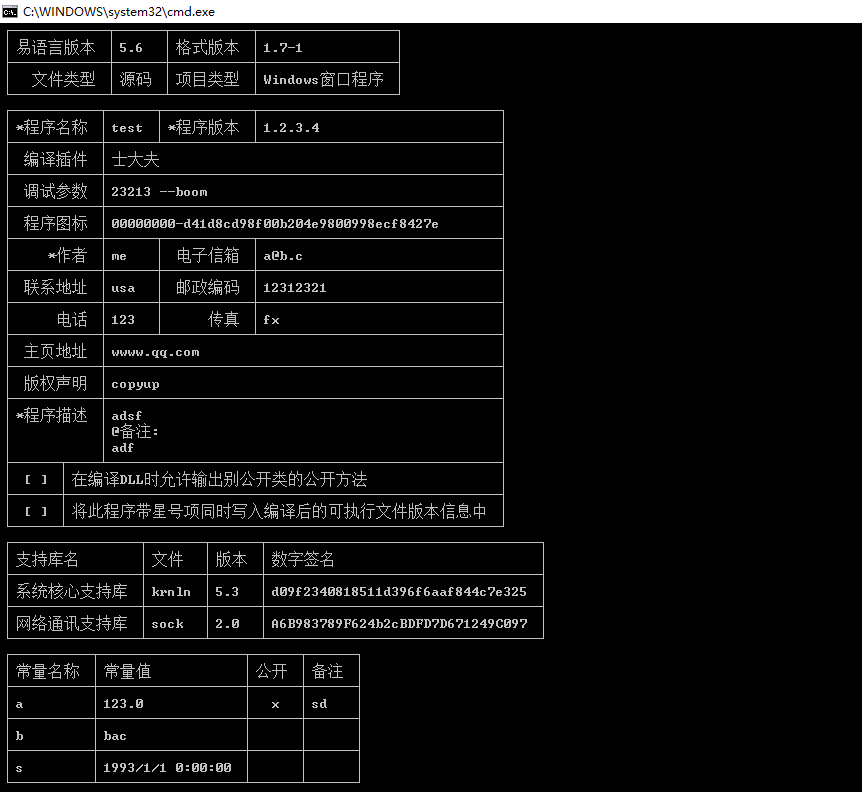
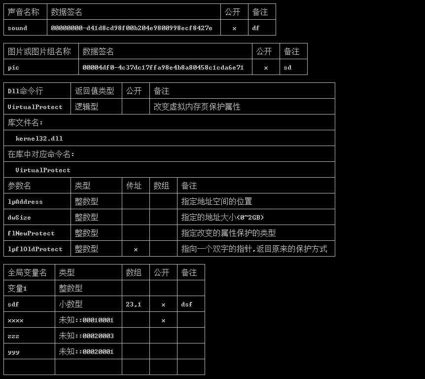
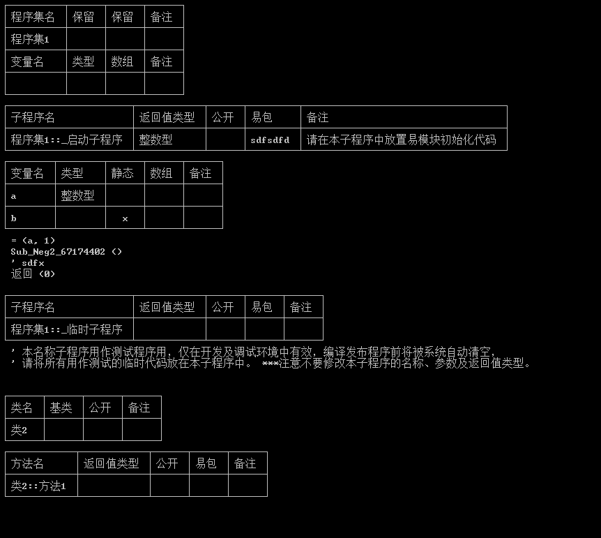
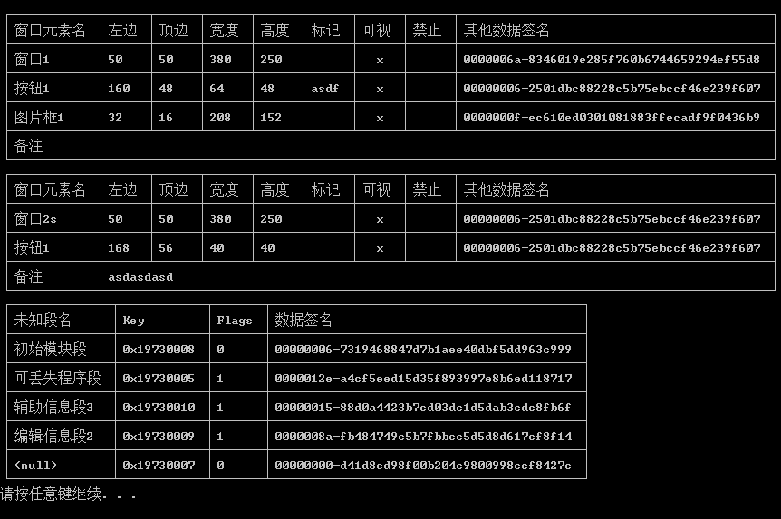

# econv

将易语言源码转为文本，可用于 git diff。

# 构成

* EProjectFile C#，反编译后魔改而来
* econv 程序主体，IronPython，用 python 主要是由方便的表格库，IronPython 方便调用 EProjectFile
* elib C，用于读取易语言支持库，C# 弄复杂的结构体麻烦

# 问题

1. 必须设置易语言支持库路径到环境变量 Path
2. IronPython Bug 原因，terminaltables 必须用 wcwidth 魔改
3. 有些字符 wcwidth 判断的宽度和 Win10 CMD 显示不同导致表格稍微出错
4. 易语言格式有些无法处理，如函数参数类型，类是否公开等
5. 支持库内类型，常量没有处理
6. 结构体等没有处理
7. 代码函数名没有处理
8. 魔改 EProjectFile 有些搜索直接 Array.Find 可能比较慢
9. IronPython 启动较慢可能导致 diff 时很慢

# 图

